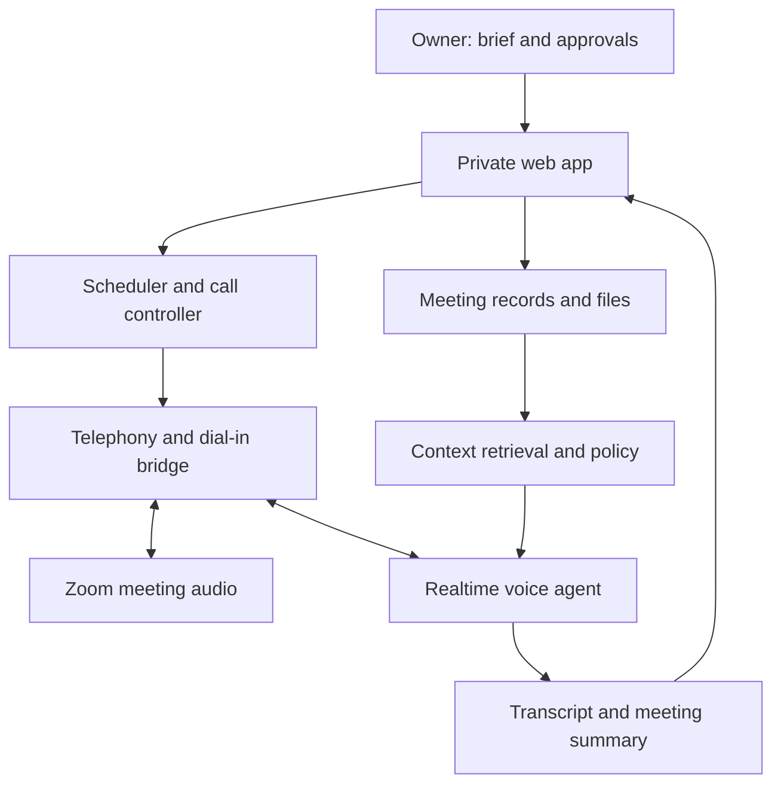

# Personal AI Meeting Assistant

**Status:** Project proposal and implementation plan · 28 September 2026

## 1. Problem

A person cannot attend every scheduled client conversation, repeat all their background context consistently, and immediately document every outcome. Existing meeting note takers mainly listen and summarize. The desired assistant should **join a scheduled meeting as a participant, speak with a client on the owner's behalf, use a meeting-specific briefing, know its limits, and return decisions and follow-ups**.

This is a **personal assistant**, independent of NEONMONKI and its CRM. No NEONMONKI product knowledge or company integration is assumed.

## 2. Goal and boundaries

For each meeting, the owner supplies the purpose, client background, documents, desired outcome, permitted commitments, forbidden commitments, and escalation contact. The assistant joins at the scheduled time, identifies itself as an AI assistant, handles the conversation, asks clarifying questions, and reports back. The owner can monitor or take over a meeting.

A pilot should support one meeting platform (Zoom), one language initially, manual briefing, audio conversation, and a reviewed summary. Automatic booking, multi-platform support, video avatar, and autonomous sending of proposals are later features.

### Success criteria for the pilot

- Joins a real scheduled test meeting and reliably hears and speaks.
- Uses the correct meeting brief and cites or paraphrases the supplied documents accurately.
- Admits uncertainty and defers commitments outside its authority.
- Handles interruptions, silence, and overlapping speech without repeated or runaway responses.
- Produces a useful summary, decisions, unresolved questions, and draft follow-up.
- Can be stopped and handed over to a human.

## 3. Proposed meeting experience

1. Owner creates a meeting record, pastes the Zoom invitation or dial-in details, and uploads a briefing and documents.
2. App validates the meeting time, phone number, meeting ID/PIN, brief, and permission rules.
3. Before the meeting, the assistant loads only this meeting's approved context.
4. At the scheduled time, a telephony bridge dials the meeting's phone number and enters its meeting ID/PIN. A human host may need to admit it or configure the meeting appropriately.
5. Assistant introduces itself transparently, listens, responds, and tracks unresolved questions. It may ask for handover when the discussion exceeds its authority.
6. On completion, the owner receives a summary and a proposed follow-up for review. The raw audio/transcript retention policy is configurable.

**Important qualification:** Phone dial-in is an architecture to prototype, not an integration proven for the owner's specific Zoom or Google Meet account. A dial-in participant may display as a phone number, may be limited by the host's settings, and cannot see screen shares. The first technical milestone is a complete two-way audio call in a real meeting.

## 4. Architecture

**Audio loop:** meeting audio → telephony bridge → realtime agent → generated speech → telephony bridge → meeting. The call controller manages dialing, PIN tones, timeout, reconnection, hang-up, and handover. The context layer retrieves only the briefing and files allowed for that meeting.

## 5. Recommended tech stack

| Component | Pilot choice | Reason / alternative |
| --- | --- | --- |
| Frontend | Next.js + TypeScript | Briefing form, meeting status, review screen. A simpler web framework is also viable. |
| Backend | Node.js + TypeScript | Scheduling, integration endpoints, permissions, events, and call state. |
| Database | PostgreSQL | Meetings, instructions, event logs, summaries, and approvals. |
| File storage | Private object storage | Briefings and client documents with per-meeting access controls. |
| Speech agent | OpenAI Realtime API | Low-latency audio input/output and tool calls. |
| Telephony | SIP-capable provider, selected after a prototype (e.g. Twilio or equivalent) | Outbound dialing, DTMF entry, and two-way audio transport; exact integration must be tested. |
| Calendar, phase 2 | Google Calendar or Microsoft Graph | Import scheduled meetings once manual scheduling works. |
| Hosting | Managed app host + secure backend worker | Persistent call processing, secrets, logs, and uptime. |
| Monitoring | Call event logs, alerts, and latency/error metrics | Diagnose failed joins, silence, dropped calls, and bad responses. |

Provider selection depends on country, available meeting dial-in numbers, outbound calling rules, latency, pricing, and whether the audio path supports a reliable bidirectional connection. Do not commit to a provider until the proof of concept works.

## 6. Key technical and product challenges

| Challenge | Design response |
| --- | --- |
| Joining as a speaking participant | Prototype Zoom phone dial-in with a real invitation and a bidirectional SIP/telephony connection first. Avoid assuming that meeting data APIs can inject speech. |
| Platform policy | Zoom Meeting SDK documentation reserves it for human use and does not support AI bot/notetaker use. Zoom realtime media streams receive meeting media; that alone does not make the assistant a speaking participant. |
| Google Meet availability | Meeting phone dial-in depends on organizer/account settings and country. The Meet Media API has preview/access constraints and read-only media scopes; validate a separate route after Zoom. |
| Meeting identity | Phone participant may appear as a number rather than a named AI. Evaluate host rename, participant naming, and client expectations in a real test. |
| Latency and turn-taking | Tune silence detection, interruptible speech, echo handling, and response length; measure actual end-to-end delay. |
| Hallucinated facts or promises | Ground responses in the approved brief; define explicit authority levels; require handover or owner review for commitments. |
| Context overload | Summarize source files ahead of the meeting and retrieve relevant passages during the conversation. Track document provenance. |
| Handover | Provide a visible stop/takeover button, escalation notification, and a graceful spoken handoff. |
| Confidentiality and recording | Disclose the AI participant. Determine meeting consent, transcription/recording permissions, retention, deletion, access, and applicable local rules before real client use. |
| Reliability | Handle wrong PIN, waiting room, absent host, dropped call, API failure, and fallback messaging to the owner. |
| Screen sharing | An audio-only dial-in cannot inspect shared slides. Require supplied documents beforehand or build a separate approved screen-content path later. |

## 7. Implementation plan and time estimate

These are **planning estimates**, assuming one experienced engineer, timely account access, and no major provider or meeting-policy blockers. Parallel design and engineering could shorten elapsed time; platform restrictions could extend it.

| Phase | Work | Estimate | Exit gate |
| --- | --- | --- | --- |
| 0. Audio feasibility | Select a SIP telephony provider; dial a real Zoom meeting; enter PIN; prove speech in both directions and inspect participant identity | 3–7 working days | Recorded test results and go/no-go decision |
| 1. Pilot assistant | Manual brief, document ingestion, voice instructions, meeting join, live controls, transcript, summary, basic failure handling | 2–4 additional weeks | Supervised calls with correct context and usable follow-up |
| 2. Unattended readiness | Calendar integration, approvals/handover, monitoring, retries, privacy controls, realistic scenario testing | 4–8 additional weeks | Repeated successful supervised trials and controlled unattended pilot |
| 3. Google Meet | Validate dial-in availability and joining details; platform-specific flow and tests | 1–3 additional weeks if dial-in is available | Successful two-way test on target accounts |

**Overall:** approximately **3–5 weeks for a usable Zoom pilot** and **7–13 weeks for a more dependable unattended version**. This is not a guaranteed delivery date; phase 0 determines feasibility and may change the implementation.

## 8. What the owner needs to provide

- One real or test Zoom meeting invitation with phone dial-in details, and a test participant.
- An OpenAI API account and a budget limit for usage.
- Access to a telephony account or approval to create one after comparing options.
- Three to five representative meeting scenarios, sample briefs, and example documents.
- A clear list of what the assistant may decide, what it must defer, and who receives escalations.
- Preferred calendar (Google or Outlook), language(s), and transcript retention preference.
- The way clients should be told that an AI assistant is participating.

For the initial audio experiment, calendar access and full client data are unnecessary; use a test meeting and fictional client brief.

## 9. Data model (initial)

- **Meeting:** ID, owner, scheduled time/time zone, platform, joining details, status.
- **Brief:** client, purpose, context, goals, agenda, allowed actions, prohibited actions, escalation contact.
- **Source:** document metadata, access scope, extracted text, provenance.
- **Call event:** join attempts, participant status, interruptions, errors, handover, end reason.
- **Outcome:** transcript if enabled, summary, decisions, unresolved items, proposed follow-up, review status.

Sensitive credentials and dial-in PINs should be encrypted and access controlled; avoid placing them in logs or model-visible text unless necessary to complete the call.

## 10. Operating rules for the assistant

1. State that it is an AI assistant at the start of a client conversation.
2. Use only approved meeting context for factual claims; ask when information is missing.
3. Follow the meeting goal without impersonating the owner as a human.
4. Never promise a price, contract term, delivery, payment, or other binding commitment unless explicitly authorized in the brief.
5. Offer human handover for sensitive decisions or when asked by the client.
6. Recap agreed next steps and distinguish confirmed decisions from proposals.
7. Send external follow-up only after the owner approves it, unless a later version has explicit sending authority.

## 11. Decisions still open

- Which meetings may be handled alone, and which require the owner present?
- Is an audio-only participant acceptable, including the possibility of a phone-number label?
- Which languages and accents are needed first?
- Should the assistant be able to read screens or only preloaded files?
- What are the budget, data retention period, and desired hosting region?
- Which calendar should be connected after the first pilot?

## 12. Immediate next step

Run phase 0 with a test Zoom invitation and a fictional brief. Measure join success, speech in both directions, conversational delay, host admission behavior, participant label, and dropout behavior. Only then lock the telephony provider and commit to the full pilot build.

## References (checked 28 September 2026)

- [OpenAI Realtime API](https://platform.openai.com/docs/api-reference/realtime): live audio and SIP interfaces.
- [Zoom: joining a meeting](https://support.zoom.com/hc/en/article?id=zm_kb&sysparm_article=KB0060732): phone dial-in when provided by the meeting.
- [Zoom Meeting SDK](https://developers.zoom.us/docs/meeting-sdk/): human-use policy for the SDK.
- [Zoom Realtime Media Streams](https://developers.zoom.us/docs/rtms/meetings/): access to live meeting media.
- [Google Meet: using a phone](https://support.google.com/meet/answer/9518557?hl=en) and [supported countries](https://support.google.com/meet/answer/9683440?hl=en).
- [Google Meet Media API](https://developers.google.com/workspace/meet/media-api/guides/overview): preview and participant/access restrictions.
