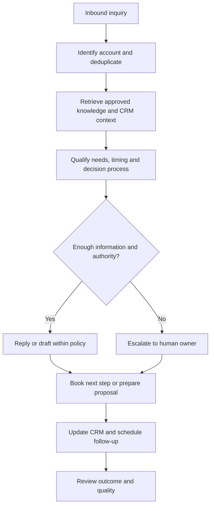
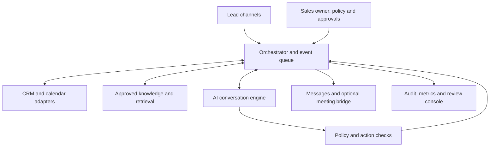
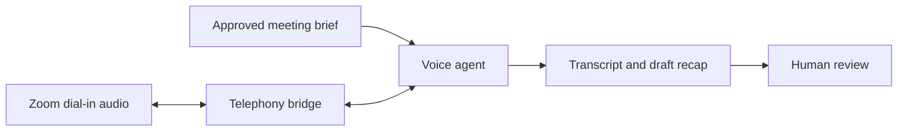

# AI Sales Representative — Client Proposal and Build Plan

**Document status:** Draft for client review · 28 September 2026  
**Scope:** One supervised AI sales representative, developed toward a full-time-equivalent (FTE) operating capacity  
**Terminology:** “FTE” describes the intended coverage and workload. It is **not** a claim that the system currently replaces a person or can operate without human oversight.

## Executive summary

The proposed AI sales representative responds to assigned leads, qualifies opportunities, answers questions from approved knowledge, schedules meetings, prepares proposals for approval, records activity in the CRM, and follows up within explicit rules. It can also join selected client meetings as a disclosed AI participant, but live meeting participation is a separate technical feasibility milestone.

The first release should be **inbound, supervised, and measurable**. A human approves pricing, commitments, outbound campaigns, and external proposals. Wider autonomy is earned only after testing against real sales cases and reviewing outcomes. This document describes the product, architecture, controls, delivery stages, dependencies, and acceptance criteria. It is a plan, not a completed implementation or a guaranteed integration.

## 1. Business outcome and scope

### Target outcomes

- Faster, consistent responses to inbound inquiries during agreed coverage hours.
- More qualified meetings and complete, accurate CRM records.
- Less manual work preparing briefs, drafts, reminders, and follow-ups.
- Clear escalation when the AI lacks information or authority.
- Measurable contribution to pipeline, with human review of quality and customer experience.

### Initial channels and capabilities

| Area | First release | Later, subject to validation |
| --- | --- | --- |
| Lead intake | One connected inbound channel or a manual lead queue | More channels, deduplication, routing |
| Conversation | Draft or send approved responses under a bounded policy | Broader autonomous conversations |
| Qualification | Ask required questions, score completeness, flag fit and urgency | Segment-specific playbooks and prioritization |
| Knowledge | Search approved product, policy, and FAQ sources with source attribution | More connected knowledge systems |
| Scheduling | Suggest slots or prepare a booking request, depending on access | Direct booking and rescheduling |
| Proposal | Collect requirements and draft an offer for human review | Restricted auto-approval for defined low-risk cases |
| CRM | Create/update assigned records with audit history | More automated opportunity workflows |
| Meetings | Prepare a brief and draft a summary | Disclosed two-way voice attendance if phase 0 succeeds |
| Reporting | Activity, handovers, response time, and quality review | Pipeline and revenue attribution |

**Out of scope at launch:** making binding promises, negotiating contracts without approval, mass unsolicited outreach, pretending to be human, and silently recording client calls.

## 2. Sales workflow

**Example:** A new customer asks for a solution, deadline, and price. The assistant checks the approved product material, asks for missing requirements, records the answers, and prepares a quotation request. If a verified price list and an explicit pricing rule exist, it may present an authorized range. Otherwise it states that the price needs review and routes the request to a salesperson. The customer sees a coherent conversation; the team receives the complete record and next action.

### Lead states

`New → Contacted → Qualified → Meeting scheduled → Proposal drafted → Proposal approved/sent → Negotiation → Won / Lost / Nurture`

Each state change records its trigger, time, actor, and source. A reminder is scheduled only when its prerequisite exists; for example, a proposal reminder requires a proposal actually sent. The precise fields and labels are mapped to the client's CRM during discovery.

## 3. Human control and decision rights

| Action | Initial rule |
| --- | --- |
| Answer a documented FAQ | Allowed when the approved source supports the answer; otherwise ask or escalate. |
| Send an inbound reply | Allowed only on an approved channel, under an approved message policy; pilot may require review before sending. |
| Follow up | Allowed only with a legitimate active conversation and configured timing, frequency, and stop rules. |
| Book a meeting | Allowed once calendar permissions, availability, time zone, and attendee confirmation are validated. |
| Quote a price, discount, lead time, or specification | Use only verified data and explicit rules; approval required outside those bounds. |
| Issue a proposal or change commercial terms | Human approval in the pilot. |
| Handle legal, sensitive, unusual, or dissatisfied-customer matters | Handover to the designated person. |
| Join a client meeting | Only if explicitly enabled for that meeting and technically proven; disclose AI identity. |

The owner can pause the assistant, inspect the conversation, edit a draft, reassign a lead, or take over. An emergency stop disables external actions while preserving the audit trail.

## 4. System architecture

**Data path:** an inbound event is assigned to a lead; the orchestrator retrieves only authorized account and knowledge context; the AI drafts a response or structured action; policy checks approve, block, or request human review; the system sends through the connected channel and writes the result back to the CRM. External actions must be idempotent so retries do not create duplicate messages or bookings.

### Suggested components

| Component | Proposed starting choice | Selection test |
| --- | --- | --- |
| Review console | Next.js + TypeScript | Clear lead timeline, policy editor, drafts, takeover, and mobile usability |
| Application/backend | Node.js + TypeScript, worker queue | Reliable scheduled actions, webhooks, retries, and audit events |
| Database | PostgreSQL | Segregated account records, permissions, event history |
| Documents | Private object storage and indexed extracted text | Access isolation, provenance, versioning, deletion |
| AI | Suitable text model; Realtime API only for the voice pilot | Quality, latency, language, cost, and data handling |
| CRM and channels | Adapters chosen for the client's actual systems | API capabilities, permissions, rate limits, and writeback |
| Meeting audio | Telephony bridge evaluated in a separate proof of concept | Real two-way speech, identity, admission, latency, compliance |
| Observability | Structured logs, alerts, evaluation samples | Join/send failures, hallucination reports, handovers, cost |

These are implementation candidates, not a commitment to specific vendors. Store API secrets outside the repository; a public GitHub README must contain no tokens, client data, meeting PINs, or private URLs.

## 5. Meeting capability: independent feasibility gate

The supplied project brief originally focused on a personal meeting assistant. That remains a useful **sales meeting module**, but it should not be treated as the foundation of the entire sales representative. Email/CRM qualification can be valuable even if live meeting joining proves unsuitable.

For the first experiment, use a test Zoom invitation with phone dial-in and a fictional client brief. A telephony service would dial the meeting number, enter the meeting ID and phone passcode, and bridge meeting audio with a realtime voice agent. This is **a hypothesis to test**, not a working or universally permitted Zoom integration. Phone participants may appear as phone numbers, need host admission, and cannot see a screen share. The host account and invitation must actually offer phone dial-in. Zoom's Meeting SDK is reserved for human use cases and does not support AI bots/notetakers; do not assume it provides a shortcut for a speaking AI participant. Google Meet's Media API is in Developer Preview with access requirements, so Meet is a separate later investigation. See the official references below.

**Exit gate:** demonstrate a disclosed, two-way test call; record join success, participant identity, interruptions, end-to-end delay, dropouts, and handover behavior. If it fails, ship the text-based sales pilot and keep human-hosted meetings with AI-prepared briefs and reviewed summaries.

## 6. Data and access model

| Entity | Minimum fields |
| --- | --- |
| Account/contact | External IDs, owner, identity, communication preferences, consent or lawful-basis status as applicable |
| Lead/opportunity | Source, owner, status, product interest, requirements, urgency, value if verified, next step |
| Conversation | Channel, participants, messages, timestamps, delivery state, source references |
| Knowledge source | Title, version, approval status, effective date, access scope, provenance |
| Policy | Allowed actions, commercial limits, escalation rules, channel permissions, version |
| Task/approval | Requested action, payload preview, reviewer, decision, expiry, outcome |
| Meeting | Time zone, join details, agenda, permitted topics, authority, call events, reviewed recap |
| Audit event | Actor, action, target, timestamp, source, policy version, result, error |

Use least-privilege access, encryption for sensitive data, retention and deletion controls, and per-client separation if serving multiple organizations. Do not put secrets or unnecessary personal data into prompts, logs, or analytics. Before live client use, the client and implementer should agree on disclosure, privacy notices, recording/transcription rules, retention, data processing arrangements, and who may access conversations; legal review depends on jurisdiction and channel.

## 7. Quality and acceptance criteria

The pilot is accepted against a **client-approved test set** of representative inquiries, edge cases, and at least several supervised real conversations. Agree numerical thresholds before implementation so the test does not move with the results.

| Measure | How to test |
| --- | --- |
| Response speed | Time from eligible inbound message to first useful response; report median and 95th percentile during coverage hours. |
| Qualification completeness | Percentage of required fields obtained or explicitly marked unknown before handover/proposal. |
| Factual accuracy | Human review against the cited approved source and current policy version. |
| Policy compliance | Zero unauthorized external sends or commercial commitments in the acceptance set. |
| Handover quality | Correct routing, context packet, and response time for out-of-scope cases. |
| CRM integrity | Correct record matching, state transitions, no duplicate writes, complete activity log. |
| Customer experience | Human review of tone and a small sample of client feedback. |
| Business impact | Qualified meetings, proposal progression, conversion, and time saved compared with a baseline; attribution remains approximate. |

Test missing information, contradictory documents, unusual pricing requests, angry clients, opt-outs, duplicated leads, multilingual messages, failed integrations, and prompt injection inside customer-supplied content. Review failures and update knowledge or policy before increasing autonomy.

## 8. Delivery plan and estimates

Estimates assume one experienced engineer, prompt access to systems and decision makers, an available API for the initial channel and CRM, and a focused first release. They are planning ranges, **not a fixed quote or delivery promise**.

| Stage | Deliverables | Estimate | Exit condition |
| --- | --- | --- | --- |
| Discovery | Confirm sales process, client systems, authority matrix, sample cases, data handling, baseline | 3–5 working days | Signed-off scope and pilot test set |
| A. Text/CRM proof of concept | Intake, approved knowledge, draft qualification, record writeback in a sandbox | 1–2 weeks | Demonstrated end-to-end lead flow |
| B. Supervised sales pilot | Review console, bounded replies, follow-up queue, handover, audit, basic metrics | 3–6 additional weeks | Supervised real leads meet agreed acceptance thresholds |
| C. Controlled expansion | More channels, calendar/proposals, monitoring, evaluation, permission refinement | 4–8 additional weeks | Stable operations and documented review results |
| M0. Meeting audio feasibility | Real Zoom test dial-in with bidirectional speech and identity checks | 3–7 working days, independently scheduled | Go/no-go for live voice module |
| M1. Meeting pilot, if M0 passes | Meeting briefs, live control, recap, failure handling | 2–4 additional weeks | Repeated supervised meetings and reviewed outcomes |

Stages can overlap after discovery. The total depends heavily on existing CRM quality, channel permissions, knowledge readiness, approval workflows, and the voice proof of concept. “Full-time-equivalent” coverage should be evaluated after the supervised pilot using volume, resolution quality, handover load, and cost; it is not an initial acceptance promise.

## 9. Client inputs and responsibilities

- Name an accountable sales owner and escalation backup.
- Provide the CRM name, sandbox/API access, one initial channel, and the desired calendar.
- Supply current product/pricing/policy documents, with owners and effective dates.
- Share 20–50 anonymized representative inquiries and examples of good responses, including difficult cases.
- Define required qualification fields, lead stages, routing, service hours, languages, and target response times.
- Approve the authority matrix, review rules, disclosure wording, follow-up limits, and retention policy.
- Provide test accounts and participants for any meeting audio feasibility experiment.

The implementation team provides the technical prototype, integration mapping, evaluation results, operational documentation, and a handover procedure. Each production connection needs a named owner and tested rollback path.

## 10. Risks and design responses

| Risk | Response |
| --- | --- |
| Outdated or conflicting sales information | Approval dates, versioned sources, clear priority, expiry alerts, human escalation. |
| Invented prices or guarantees | Structured verified fields, policy checks, and approval gates. |
| Incorrect contact or account match | Confidence thresholds and human review before merging or messaging ambiguous records. |
| Spam or unwanted follow-up | Channel-specific eligibility, frequency caps, stop rules, and opt-out handling. |
| Data leakage across customers | Tenant isolation, scoped retrieval, permission tests, redaction, audit. |
| Message or CRM duplication after retries | Idempotency keys, delivery reconciliation, event log. |
| Prompt injection in inbound messages or files | Treat external content as data, enforce actions through server-side policy, test adversarial cases. |
| Failed meeting connection | Separate feasibility gate and a human-hosted meeting fallback. |
| Model/provider changes or cost growth | Track quality and unit costs; keep business rules and adapters independent of the model. |

## 11. Decisions to finalize at kickoff

1. Which company/team and sales process is this for, and does “FTE” mean 24/7 coverage, one person's workload, or a specific lead volume?
2. Which single inbound channel and CRM are first? Who may authorize access?
3. Can the pilot send any messages automatically, or must all external replies be approved?
4. Which prices, discounts, timelines, and promises may the AI communicate?
5. What languages, service hours, regions, data residency, and retention are required?
6. Is live attendance at sales meetings essential for the first release, or an optional module after the text pilot?
7. What baseline and target numbers define a successful pilot?

## 12. Immediate next step

Run discovery with anonymized lead examples and a CRM sandbox. Approve the authority matrix and the acceptance test set, then build the end-to-end text/CRM proof of concept. In parallel, run the Zoom audio test only if meeting attendance is required for the pilot. Do not promise unattended sales coverage until supervised results establish that it is safe and useful.

## Official technical references

Checked 28 September 2026. Vendor features and policies should be rechecked during implementation.

- [OpenAI Realtime API reference](https://platform.openai.com/docs/api-reference/realtime) — low-latency audio interfaces, including SIP.
- [Zoom: joining a meeting](https://support.zoom.com/hc/en/article?id=zm_kb&sysparm_article=KB0060732) — phone dial-in, meeting ID, and passcode when available.
- [Zoom Meeting SDK documentation](https://developers.zoom.us/docs/meeting-sdk/) — usage policy for human use cases.
- [Google Meet Media API overview](https://developers.google.com/workspace/meet/media-api/guides/overview) — Developer Preview and access conditions.

---

**Repository note:** This README is a product specification and proposal. Add installation commands, environment variable names, architecture decision records, and operating runbooks only once corresponding code and integrations exist. Never commit credentials or real customer information.
